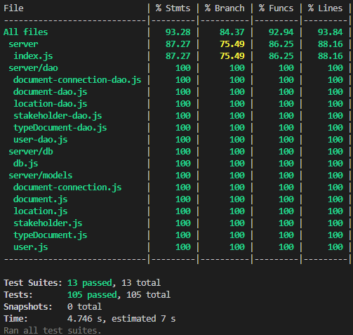

# RETROSPECTIVE (Team 17)

The retrospective should include _at least_ the following
sections:

- [PROCESS MEASURES](#process-measures)
- [QUALITY MEASURES](#quality-measures)
- [GENERAL ASSESSMENTS](#assessment)

## PROCESS MEASURES

### Macro statistics

- Number of stories committed vs. done
  - committed: 3
  - done: 3
- Total points committed vs. done
  - committed: 8
  - done: 8
- Nr of hours planned vs. spent (as a team)
  - planned: 84h 00m
  - spent: 80h 35m

**Remember** a story is done ONLY if it fits the Definition of Done:

- Unit Tests passing
- Code review completed
- Code present on VCS
- End-to-End tests performed

### Detailed statistics(check )

| Story                                           | # Tasks | Points | Hours est. | Hours actual |
| ----------------------------------------------- | ------- | ------ | ---------- | ------------ |
| _#0_                                            | 19      |        | 46h    | 44h 5m      |
| 07 - Add original resources to a document       | 4       | 1      | 11h         | 11h           |
| 08 - Search documents                           | 3       | 2      | 8h         | 7h 30m       |
| 09 - Define geolocated area                     | 6       | 5      | 19h        | 18h      |

- Hours per task average, standard deviation (estimate and actual)
  - task average:
    - estimated: 2.63 h
    - actual: 2.60 h
  - standard deviation:
    - estimated: 1.81 h
    - actual: 2.23 h
- Total estimation error ratio: sum of total hours spent / sum of total hours effort - 1

  $$\frac{\sum_i spent_{task_i}}{\sum_i estimation_{task_i}} - 1 = -0.01091$$

- Absolute relative task estimation error: sum( abs( spent-task-i / estimation-task-i - 1))/n

  $$\frac{1}{n}\sum_i^n \left| \frac{spent_{task_i}}{estimation_{task_i}}-1 \right| = 0.21717$$

## QUALITY MEASURES

- Unit Testing:
  - Total hours estimated: 10h
  - Total hours spent: 10h
  - Nr of automated unit test cases: 105
  - Coverage (if available): around 90%

  

- E2E testing:
  - Total hours estimated: 3h
  - Total hours spent: 3h
- Code review
  - Total hours estimated: 4h
  - Total hours spent: 5h 30m

## ASSESSMENT

- What caused your errors in estimation (if any)?

  - we encountered some unforseen issues with coding environments and unexpected bugs occured.
    including having problem with react leaflet and the view of different documents icon and colors.

  - Another challenge in our estimates arose from unexpected issues with modifying an area, which required additional time to understand and implement. This was further complicated by our lack of prior experience working with maps.

- What lessons did you learn (both positive and negative) in this sprint?

  - Positive:

    - Regular team checks and meetings helped us catch errors early, and working together helped to understand the project requirements better.
    - It also showed us that regular updates help prevent small issues from turning into larger problems. as well as breaking down tasks into separate parts.

  - Negative:

    - Not all requirements were clear, which resulted in some rework and delays. Moving forward, we learned the importance of thoroughly reviewing all details with the team and stakeholders before starting development. Specifically, during discussions via telegram with the product owner, clarifications led to changes in tasks, such as enhancing the document search feature to include filters for date, document type, and more, rather than just searching by name.

- Which improvement goals set in the previous retrospective were you able to achieve?

  - Enhance Task Break down: We broke down tasks so we managed to observe details better and due to that in this sprint our estimation was more accurate.
  - We increased the number of meetings to ensure better alignment and address key challenges effectively.
  - We worked on the front-end and back-end development in parallel, frequently merging code throughout the sprint to ensure that everyone had a clear understanding of the specifications.

- Which ones you were not able to achieve? Why?
  - We nearly achieved all our goals, but as we progress as a team, we recognize the need to continuously set goals to improve ourselves and adapt to evolving project conditions. However, overlapping dependencies sometimes made it difficult to complete certain parts simultaneously. Additionally, receiving clarifications via telegram by the product owner, occasionally delayed progress, as some tasks had to wait for others to be completed.
