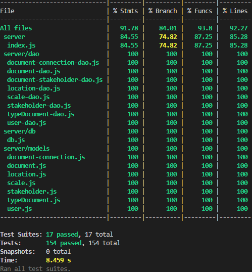

# RETROSPECTIVE (Team 17)
=====================================

The retrospective should include _at least_ the following
sections:

- [process measures](#process-measures)
- [quality measures](#quality-measures)
- [general assessment](#assessment)

## PROCESS MEASURES 

### Macro statistics

- Number of stories committed vs. done
  - committed: 4
  - done: 4
- Total points committed vs. done
  - committed: 21
  - done: 21
- Nr of hours planned vs. spent (as a team)
  - planned: 81h 
  - spent: 80h

**Remember**  a story is done ONLY if it fits the Definition of Done:
 
- Unit Tests passing
- Code review completed
- Code present on VCS
- End-to-End tests performed

### Detailed statistics

| Story  | # Tasks | Points | Hours est. | Hours actual |
|--------|---------|--------|------------|--------------|
| _#0_                                            | 22      |        | 65h    | 64h      |
| 19 - Select and existing area or point instead of creating new one     | 1       | 1      | 1h         | 1h           |
| 10 - Visualize documents on diagram                          |    5    | 13      | 10h30m         | 8h 30m       |
| 20 - Cluster points/areas                    | 2       | 5      | 4h        | 4h30m      |
| 14 - Click  on documents show on diagram          | 1      | 2      | 3h        | 2h      |

- Hours per task (average, standard deviation)
  - task average:
    - estimated: 2.53 h
    - actual: 2.50 h
  - standard deviation:
    - estimated: 1.90 h
    - actual: 1.90 h
- Total task estimation error ratio: sum of total hours estimation / sum of total hours spent -1

  
## QUALITY MEASURES 

- Unit Testing:
  - Total hours estimated: 4h
  - Total hours spent: 4h
  - Nr of automated unit test cases : 154 
  - Coverage (if available): around 90%
    - 
- E2E testing:
  - Total hours estimated: 2h
  - Total hours spent: 2h
- Code review 
  - Total hours estimated: 4h
  - Total hours spent: 3h
- Technical Debt management
  - Strategy adopted: 
    - We fixed technical debt issues after the implementation of the stories, right before the release date. We split in technical debt for frontend and technical debt for backend. We reached the quality gate level with not so much effort because everything was quite ok, no big problems.  
  - Total hours estimated at sprint planning: 8h
  - Total hours spent: 7h
  

## ASSESSMENT

- What caused your errors in estimation (if any)?

  - During this sprint, we did not encounter significant issues with task estimation. This success was largely due to our improved ability to clearly define and separate tasks. While we faced challenges in managing the diagram creation process, we accurately estimated the effort required to complete it.

- What lessons did you learn (both positive and negative) in this sprint?

  - Positive:

    - Again Regular team checks and meetings helped us catch errors early, and working together helped to understand the project requirements better.

  - Negative:

    - Not all requirements were initially clear, which led to some rework and minor delays. However, unlike previous sprints, we promptly reached out to the Product Owner (PO) to clarify the requirements. This proactive approach helped us avoid recurring issues and improved our overall efficiency.

- Which improvement goals set in the previous retrospective were you able to achieve?

  - One of the improvement goals set in the previous retrospective was to promptly seek clarification from the Product Owner (PO) whenever requirements were unclear. We successfully implemented this practice, ensuring we understood all necessary details upfront. This proactive approach significantly reduced errors and prevented potential problems, leading to smoother task execution.
  - We increased the number of meetings to ensure better alignment and address key challenges effectively.

- Which ones you were not able to achieve? Why?
  - We did not encounter any major issues this sprint, as we maintained our focus and effectively addressed potential challenges before they became problems. By building on the improvements from previous sprints, we were able to work without significant errors or setbacks.
  - We aim to allocate more time to addressing technical debt in the upcoming sprints. By simplifying our codebase, we hope to reduce potential issues and improve overall maintainability.
