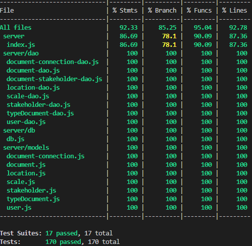

# RETROSPECTIVE (Team 17)
=====================================

The retrospective should include _at least_ the following
sections:

- [process measures](#process-measures)
- [quality measures](#quality-measures)
- [general assessment](#assessment)

## PROCESS MEASURES 

### Macro statistics

- Number of stories committed vs. done
  - committed: 7
  - done: 7
- Total points committed vs. done
  - committed: 21
  - done: 21
- Nr of hours planned vs. spent (as a team)
  - planned: 80h 
  - spent: 80h25m

**Remember**  a story is done ONLY if it fits the Definition of Done:
 
- Unit Tests passing
- Code review completed
- Code present on VCS
- End-to-End tests performed

### Detailed statistics

| Story  | # Tasks | Points | Hours est. | Hours actual |
|--------|---------|--------|------------|--------------|
| _#0_                                            | 24      |        | 47h55m    | 50h25m      |
| 11 - Visualize the area associated with the different documents     | 2       | 2      | 4h        | 4h           |
| 17 - See on the diagram the document selected in the map                          |    1    | 3      | 2h30m         | 30m       |
| 12 -  Adjust the position of documents on the diagram                    | 2       | 5      | 4h        | 4h      |
| 13 -  Adjust the connections of documents on the diagram         | 6      | 3      | 9h        | 9h30m      |
| 15 -  Filter the documents shown on the diagram         | 1      | 3      | 1h30m        | 1h30m      |
| 16 -  See on the map the document selected in the diagram         | 1      | 3      | 2h        | 30m      |
| 18 -  Add one or more attachments for a document         | 8      | 2      | 10h30m        | 10h      |
- Hours per task (average, standard deviation)
  - task average:
    - estimated: 1.78h 
    - actual: 1.79h
  - standard deviation:
    - estimated: 1.50h
    - actual: 1.56h
- Total task estimation error ratio: sum of total hours estimation / sum of total hours spent -1
  - -0.00518

  
## QUALITY MEASURES 

- Unit Testing:
  - Total hours estimated: 5h
  - Total hours spent: 5h
  - Nr of automated unit test cases : 170 
  - Coverage (if available): around 90%
    - 
- E2E testing:
  - Total hours estimated: 4h30m
  - Total hours spent: 4h30m
- Code review 
  - Total hours estimated: 3h
  - Total hours spent: 3h
- Technical Debt management
  - Strategy adopted: 
    - We use SonarQube with the Automatic Analysis method on our GitHub repository. This setup ensures that every time changes are pushed, we can quickly assess the clarity of the code in near real-time.
        Our top priority was ensuring that the code successfully passed the quality gate.
        Once that was achieved, we addressed issues on both the client and server sides, starting with those of high severity and then progressing to medium and low-severity issues.
        We focus  on keeping the percentage of duplicated lines below 3% and fix immediately problems of security ecc.
        Every group member contributed to improving the code. Those primarily working on the backend focused on enhancing the code in the Server folder, while the same approach was taken by those working on the frontend. 
  - Total hours estimated at sprint planning: 8h
  - Total hours spent: 9h 5m
  
## ASSESSMENT

- What caused your errors in estimation (if any)?

  - During this sprint, we did not encounter significant issues with task estimation. This success was largely due to our improved ability to clearly define and separate tasks. While we faced challenges in managing the diagram axis and draggable documements , we accurately estimated the effort required to complete it.

- What lessons did you learn (both positive and negative) in this sprint?

  - Positive:

    - Regular team meetings and check-ins allowed us to catch errors early and collaborate effectively, improving our understanding of the project requirements.

  - Negative:

    - Not all requirements were initially clear, which led to some rework and minor delays. However, unlike previous sprints, we promptly reached out to the Product Owner (PO) to clarify the requirements. This proactive approach helped us avoid recurring issues and improved our overall efficiency.

- Which improvement goals set in the previous retrospective were you able to achieve?

  - One of the improvement goals set in the previous retrospective was to promptly seek clarification from the Product Owner (PO) whenever requirements were unclear. We successfully implemented this practice, ensuring we understood all necessary details upfront. This proactive approach significantly reduced errors and prevented potential problems, leading to smoother task execution.
  - We increased the number of meetings to ensure better alignment and address key challenges effectively.
  - We successfully allocated more time to addressing technical debt in the recent sprints. By simplifying our codebase, we managed to reduce potential issues and significantly improve overall maintainability. 

- Which ones you were not able to achieve? Why?
  - We did not encounter any major issues this sprint, as we maintained our focus and effectively addressed potential challenges before they became problems. By building on the improvements from previous sprints, we were able to work without significant errors or setbacks.
